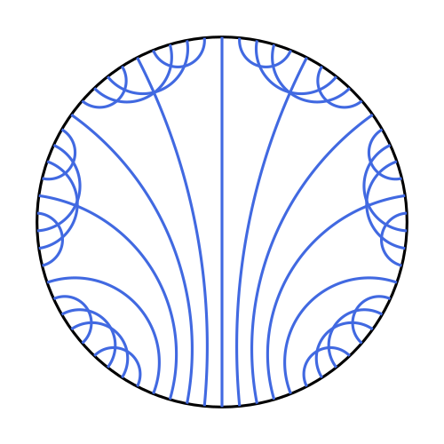

# Chord diagrams

Chord diagrams are combinatorial invariants corresponding to ideal arc systems on the surface. The main purpose of this code is to visualize the chord diagrams in their hyperbolic geodesics form. For enumeration purposes, I think it would have been better to convert them into triangulations of the Euclidean $(12g-6)$-gon, but the hyperbolic geodeics are much more aesthetically pleasing.

The outputs is in the `.svg` format because I wanted to use these diagrams in my LaTeX notes. You need the Python library `svgwrite` to create svg diagrams. Here are some examples:

 
 

<figure>
  
  <figcaption style="text-align: center;">The fan triangulation of a genus 6 surface.</figcaption>
</figure>

 
 
 

<figure>
  
  <figcaption style="text-align: center;">An elementary move about the red chord on a genus 3 surface.</figcaption>
</figure>

 
 
 

I am following the notation used by Lee Mosher in his paper [A User's Guide to the Mapping Class Group: Once Punctured Surfaces](https://arxiv.org/abs/math/9409209). The chord diagrams are stored as a string of $(6g-3)$-many pairs. The pairs denote the involution $\text{Opp}$, the map which determines which ends are connected. The ends are enumerated couter-clockwise, with the northmost point being labelled as $1$. It is also possible to store any ideal arc system in a similar format. 

### `get-fan.py` and `enumeration.py`

The `get-fan.py` file gives you the chord pairing corresponding to the fan triangulation for an even-genus surface (I forgot to do this for odd genus, and this file is not used anymore). It also gives you the fan triangulation in the svg format.

The main file is `enumeration.py`, which gives you the total number of nonisomorphic chord diagrams. It can also create svg files showing the following:
1. chord diagram before the elementary move with `moveAbout` chord and its adjacant chords highlighted.
2. the support quadrilateral.
3. chord diagram after the elementary move.
There is no file named `1.svg` as the fan triangulation itself is the first enumeration.

### Results

Since the `get-fan.py` file gives triangulation pairs only for even genera, I did the odd ones (luckily, only $g=3$) manually. The code yields the following figures:

| Genus | $n_g$ |
|---|---|
| 1 | 1 |
| 2 | 9 |
| 3 | 1,726 |
| 4 | 1,349,005 |

These numbers for genera 1-3 are given in the above paper. $n_4$ can be verified by a number of other papers, such as the page 88 of [this](https://www.pdmi.ras.ru/pdmi/system/files/dissertations/dissertation_0.pdf) paper. When I was looking for papers to verify $n_4$, I came across the page 26 of [this](https://arxiv.org/pdf/1209.0334) paper, where the number $1,349,005$ pops up in bi-partite graph counting in the context of Feynman diagrams and QFT.

### Future directions

1. Since the ideal triangulations complex is connected, you can go to any ideal triangulation given any other. It remains to write a code to find the shortest path between two given idelal triangulations.
2. I would like to understand how exactly the chord diagrams enumeration and Feynman diagrams are related.
